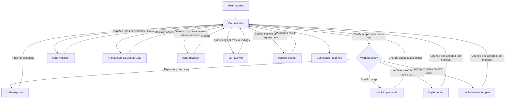

# Portable Codex and OpenCode subagents

This repository packages equivalent custom subagent definitions and routing
rules for Codex and OpenCode. It contains no credentials or project data.

## Repository layout

- `agents/` — TOML definitions for the available custom agents.
- `opencode/agents/` — native OpenCode Markdown definitions for the same roles.
- `rules/SUBAGENT_ROUTING.md` — delegation, ownership, validation, and role-selection rules.
- `rules/OPENCODE_SUBAGENT_ROUTING.md` — routing rules using OpenCode's native task semantics.
- `templates/AGENTS.md.template` — a minimal manual global-instructions example.
- `install.sh` / `uninstall.sh` — guarded installer and remover for Codex.
- `install-opencode.sh` / `uninstall-opencode.sh` — guarded installer and remover for OpenCode.

## Subagent catalog

Use the exact agent name when delegating work.

| Agent | Model / effort | Primary responsibility |
| --- | --- | --- |
| `code-explorer` | GPT-5.6 Luna / low | Read-only repository discovery and decision-ready findings. |
| `quick-implementer` | GPT-5.6 Luna / low | Small, well-scoped one- or two-file changes with focused checks. |
| `implementer` | GPT-5.6 Luna / max | Default implementation for architecture- and plan-clear regular work, including targeted unit tests. |
| `implementer-complex` | GPT-5.6 Terra / high | Accepted-plan implementation involving complex concurrency, migrations, cross-module invariants, or multi-round difficult repairs. |
| `code-validator` | GPT-5.6 Luna / low | Read-only, focused test, build, lint, or type-check verification. |
| `code-reviewer` | GPT-5.6 Terra / high | Read-only standard review for high-risk, public-API, or difficult changes. |
| `code-reviewer-deep` | GPT-5.6 Sol / high | Escalation-only deep review for unresolved material risk. |
| `ux-reviewer` | GPT-5.6 Terra / medium | Exploratory black-box UX review for qualifying user-facing frontend changes. |
| `commit-pusher` | GPT-5.6 Luna / low | Intentional staging, conventional commit, and push—only on explicit request. |

## Orchestrator workflow

The orchestrator owns scope, integration, and the final outcome. Subagents own
bounded work; they share the same workspace and must preserve unrelated edits.



In brief, exploration and bounded implementation are delegated by default;
architecture- and plan-clear routine work goes to `implementer`, while
`implementer-complex` is reserved for accepted-plan complex concurrency,
migrations, cross-module invariants, or multi-round difficult repairs. File
count, diff size, and mechanical multi-module synchronization alone do not
justify the upgrade. Validation is separate from implementation; on failure,
the original implementation role is resumed for at most two repair cycles.
Every implementation role must stop at the Architecture Deviation Gate rather
than silently changing an accepted boundary or contract. Review is for
high-risk or difficult-to-validate changes: standard high-risk and qualifying
UX review use Terra roles, while Sol is reserved for design and deep review
escalation. Commit/push is only used when explicitly requested.

## Prerequisites and configuration

- POSIX `sh` and Python 3.8+.
- Agent TOML files are validated with Python `tomllib` when available.
- Existing `config.toml` files that require parsing need Python 3.11+
  (`tomllib`) or the installable `tomli` package. A missing parser or malformed
  TOML stops installation before destinations are changed.

For a Windows Codex installation, run the installers from Git Bash. Do not run
them from PowerShell when `bash` resolves to WSL. WSL keeps POSIX path
semantics, and this README makes no claim that a WSL invocation targets a
Windows Codex installation. The scripts select the first candidate that
actually starts and reports Python 3.8+ (`python3`, then `python`, then Windows
`py -3`). Path conversion follows the selected Python runtime: only a
MINGW/MSYS/CYGWIN shell paired with Windows-native `sys.platform == "win32"`
uses `cygpath -w`; POSIX-native Python keeps POSIX paths.

Codex files default to `$HOME/.codex`; OpenCode files default to
`$HOME/.config/opencode`. Set `CODEX_HOME` or `OPENCODE_HOME` to override them:

```sh
CODEX_HOME=/path/to/.codex ./install.sh
OPENCODE_HOME=/path/to/opencode ./install-opencode.sh
```

In Git Bash, the defaults still refer to the current user's Windows home, and
custom overrides may use Git Bash paths such as `/c/Users/name/.codex`; path
conversion is applied only when the selected Python is Windows-native. With a
POSIX-native Python, paths keep their POSIX meaning. On Unix, paths keep their
normal POSIX meaning.

## Install

```sh
./install.sh
./install-opencode.sh
```

The OpenCode installer writes agents to
`$OPENCODE_HOME/agents` (default `~/.config/opencode/agents`), installs the
OpenCode routing rules, and adds a managed import to `AGENTS.md`. Each OpenCode
agent pins the `openai/` equivalent of its Codex model and uses `variant` to
match the Codex reasoning effort. Restart OpenCode after installing because its
configuration is not hot-reloaded.

The installer copies agent definitions to `$CODEX_HOME/agents`, installs
`SUBAGENT_ROUTING.md`, and adds a managed import block to
`$CODEX_HOME/AGENTS.md`. It enables `[features.multi_agent_v2]` with
`hide_spawn_agent_metadata = false` and `tool_namespace = "agents"` only when
that table is not already defined. Existing files are backed up before being
replaced or modified. A state manifest at
`$CODEX_HOME/.subagents_configs-state.json` records ownership and hashes.

Re-running is safe: unchanged managed files remain unchanged, and stale package
files are removed or restored only when their installed bytes still match the
recorded hash. User-modified files are preserved. The installer does not rewrite
an existing multi-agent feature table.

## Uninstall

```sh
./uninstall.sh
./uninstall-opencode.sh
```

The OpenCode command removes package-managed OpenCode files using its independent
state manifest while preserving modified or pre-existing files. Each uninstaller
only affects its corresponding tool.

Uninstall uses the state manifest to remove only package-owned files whose bytes
still match, restoring backups for replaced files. It removes only the exact
managed block from `AGENTS.md` (after making a backup), preserving surrounding
content and edits. The installer-added `config.toml` feature block is
intentionally left in place because ownership cannot be safely proven after
edits. If no valid state manifest exists, nothing is removed.

## Manual setup and verification

For a manual setup, copy the TOML files into `$CODEX_HOME/agents`, copy
`rules/SUBAGENT_ROUTING.md` to `$CODEX_HOME/SUBAGENT_ROUTING.md`, and add the
absolute-path import shown in `templates/AGENTS.md.template` to
`$CODEX_HOME/AGENTS.md`. Ensure the multi-agent feature table is present in
`$CODEX_HOME/config.toml` if your Codex installation requires it.

After installation, verify the output reports `TOML validation passed` (or the
documented validation skip), inspect the installed files under `$CODEX_HOME`,
and run the installer a second time to confirm it reports unchanged files.
